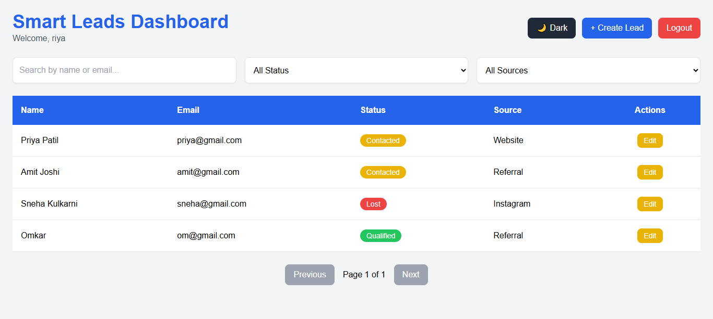
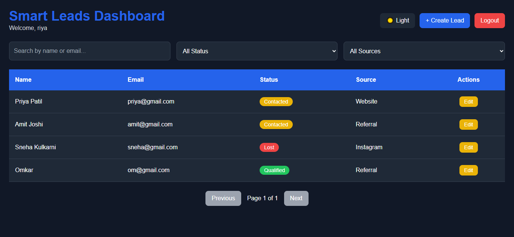
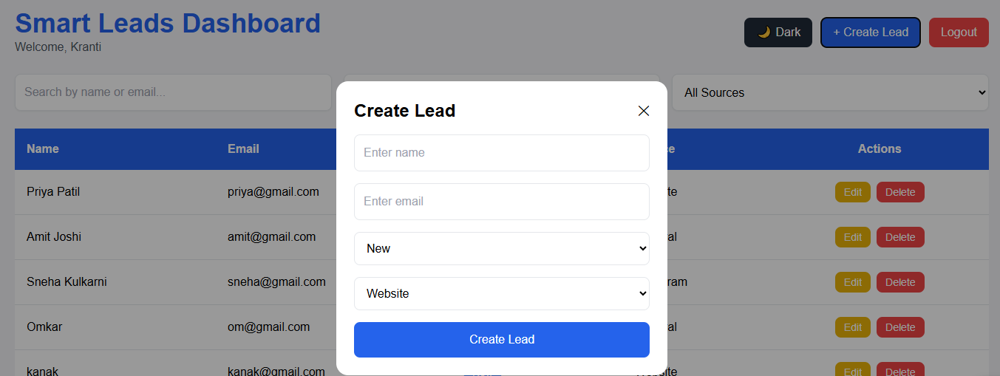
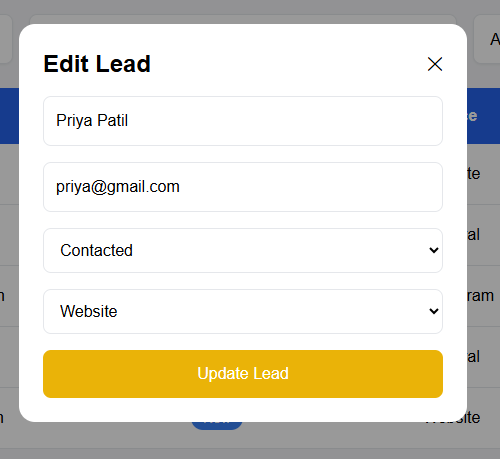

# Smart Leads Dashboard

A full-stack CRM dashboard application built using the MERN Stack with TypeScript.

---

## 🚀 Live Demo

### Frontend

[https://smart-leads-dashboard-rho.vercel.app](https://smart-leads-dashboard-rho.vercel.app)

### Backend API

[https://smart-leads-dashboard-f1ez.onrender.com](https://smart-leads-dashboard-f1ez.onrender.com)

---

## 📌 Features

### Authentication & Authorization

* JWT Authentication
* Login & Registration
* Protected Routes
* Role-Based Access Control (Admin / Sales)

### Lead Management

* Create Leads
* View Leads
* Update Leads
* Delete Leads (Admin Only)
* Search Leads
* Filter by Status
* Filter by Source
* Pagination
* CSV Export

### UI/UX

* Responsive Dashboard
* Dark Mode
* Toast Notifications
* Loading Spinner
* Modal Forms
* Status Badges

---

## 🛠️ Tech Stack

### Frontend

* React
* TypeScript
* Tailwind CSS
* Axios
* React Router DOM
* React Hot Toast
* Vite

### Backend

* Node.js
* Express.js
* TypeScript
* MongoDB Atlas
* Mongoose
* JWT Authentication
* Zod Validation

### Deployment

* Frontend: Vercel
* Backend: Render
* Database: MongoDB Atlas

---

## 📂 Folder Structure

```bash
smart-leads-dashboard/
│
├── client/
│   ├── src/
│   ├── components/
│   ├── pages/
│   ├── services/
│   └── types/
│
├── server/
│   ├── src/
│   ├── controllers/
│   ├── models/
│   ├── routes/
│   ├── middlewares/
│   └── validations/
```

---

## ⚙️ Environment Variables

### Backend (.env)

```env
PORT=5000
MONGO_URI=your_mongodb_connection_string
JWT_SECRET=your_secret_key
```

---

## 💻 Installation & Setup

### Clone Repository

```bash
git clone https://github.com/Kranti-19/smart-leads-dashboard.git
```

---

### Backend Setup

```bash
cd server
npm install
npm run dev
```

---

### Frontend Setup

```bash
cd client
npm install
npm run dev
```

---

## 📡 API Endpoints

### Auth Routes

| Method | Endpoint           |
| ------ | ------------------ |
| POST   | /api/auth/register |
| POST   | /api/auth/login    |

### Lead Routes

| Method | Endpoint              |
| ------ | --------------------- |
| GET    | /api/leads            |
| POST   | /api/leads            |
| PUT    | /api/leads/:id        |
| DELETE | /api/leads/:id        |
| GET    | /api/leads/export/csv |

---

## 📸 Screenshots
---

### Dashboard - Light Mode



---

### Dashboard - Dark Mode



---

### Create Lead Modal



---

### Edit Lead Modal



---

## 🌟 Future Improvements

* Analytics Dashboard
* Charts & Reports
* Email Notifications
* Lead Assignment System
* Activity Tracking
* Kanban Board View

---

## 👩‍💻 Author

### Kranti Holkar

* GitHub: [https://github.com/Kranti-19](https://github.com/Kranti-19)

---

## ⭐ Support

If you liked this project, consider giving it a star on GitHub ⭐
